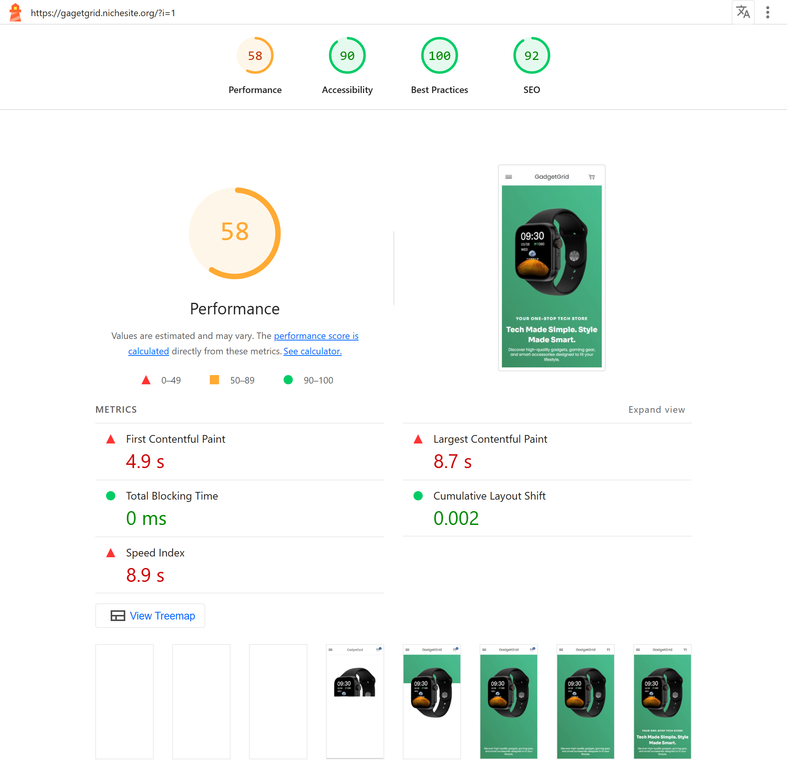

# WooCommerce Website Optimization Case Study

### Project Overview

This project showcases how I optimized a WooCommerce website’s performance using WordPress caching, script management, and CDN configuration — without writing any custom code.
The optimization was performed locally in a development environment. Due to free hosting limitations, the live site may not fully reflect these results, but the case study demonstrates what’s possible with proper setup.

### Initial Performance

- Mobile Score: 58
- First Contentful Paint (FCP): 4.9s
- Largest Contentful Paint (LCP): 8.7s
- Speed Index: 8.9s

## Optimization Process
### Plugins & Tools Used

- WP Rocket – caching, CSS/JS minification, preloading, CDN integration
- Perfmatters – disabling unused scripts, instant page, lazy loading
- Woostify Theme – theme foundation

### Key Adjustments

- Enabled full-page caching & browser caching
- Minified and combined CSS/JS files
- Removed unused CSS via Perfmatters
- Configured lazy loading for images/iframes
- Preloaded key resources (fonts, images)

## Results After Optimization

- Mobile Score: 90+
- First Contentful Paint (FCP): ~2.3s
- Largest Contentful Paint (LCP): ~2.8s
- Speed Index: ~2.3s

## Key Takeaways

- Even without editing core code, significant performance gains are possible with the right plugin configuration and CDN setup.
- WooCommerce sites require special care due to their heavy scripts and database calls.
- Hosting limitations (e.g., free hosting) can bottleneck results — real-world performance will improve further on premium hosting.
